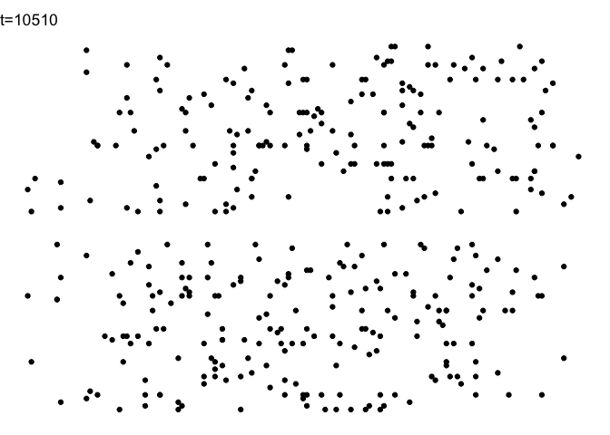

AoC 2018 Day 10: The stars align
================
FlorianGD
Tue Dec 11 15:59:51 2018

``` r
library(tidyverse)
```

    ## ── Attaching packages ───────────────────────────────────────────────────── tidyverse 1.2.1 ──

    ## ✔ ggplot2 3.1.0     ✔ purrr   0.2.5
    ## ✔ tibble  1.4.2     ✔ dplyr   0.7.8
    ## ✔ tidyr   0.8.2     ✔ stringr 1.3.1
    ## ✔ readr   1.2.1     ✔ forcats 0.3.0

    ## ── Conflicts ──────────────────────────────────────────────────────── tidyverse_conflicts() ──
    ## ✖ dplyr::filter() masks stats::filter()
    ## ✖ dplyr::lag()    masks stats::lag()

``` r
# devtools::install_github('thomasp85/gganimate')
# devtools::install_github("r-rust/gifski")
# install.packages("transformr")
library(gganimate)


parse_input <- function(input) {
  pos_and_speeds <- input %>% 
    read_lines() %>% 
    str_extract_all("-?\\d+", simplify=TRUE) %>% 
    as_tibble() %>% 
    map_dfr(as.integer)
  colnames(pos_and_speeds) <- c("x", "y", "vx", "vy")
  list(select(pos_and_speeds, "x", "y"),
       select(pos_and_speeds, "vx", "vy"))
}


plot_time <- function(pos_and_speeds, times) {
  pos <- pos_and_speeds[[1]]
  speeds <- pos_and_speeds[[2]]
  names(times) <- times  # for the .id
  times %>% 
    map_dfr(~pos + .x * speeds, .id = "time") %>% 
    mutate(time = as.integer(time)) %>% 
    ggplot(aes(x, y)) +
    geom_point() +
    coord_equal() +
    theme_void() +
    labs(title = "t={closest_state}") +
    transition_states(time, 
                      transition_length = 3,
                      state_length = 5) +
    ease_aes('sine-in-out')
}


# With trial and error
parse_input("day10_input.txt") %>% 
  plot_time(c(10510, 10519, 10528))
```



``` r
pos_and_speeds <- parse_input("day10_input.txt")
pos <- pos_and_speeds[[1]]
speeds <-  pos_and_speeds[[2]]
```

We need to flip the y value to plot it in the good order

``` r
(pos + 10519 * speeds) %>%
  mutate(y=-y) %>% 
  ggplot(aes(x, y)) +
  geom_point() +
  theme_void() +
  coord_equal()
```


