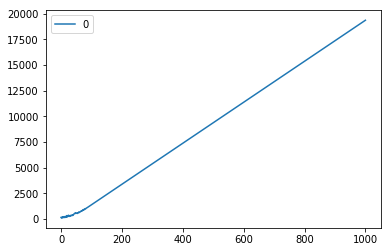
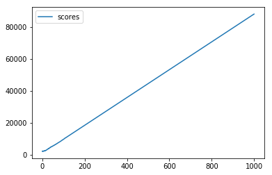

# AoC 2018 Day 12: Subterranean Sustainability


```python
import pandas as pd
import matplotlib.pyplot as plt
%matplotlib inline
```


```python
from day12 import *
```

## Part 2
We need to compute the score at `n_gen=50000000000`. It would take years to compute the score iteratively. But there maybe some regularity after some iterations (we keep going on the same patterns over and over again).

Let's inspect that.


```python
test_init, test_dict = parse_input("day12_test_input.txt")
```

I change the function to compute the score to a generator, to keep all the values.


```python
def play_gen(init, next_dict, n_gen=20):
    state = init
    yield compute_score(state, 0)
    for zero_ind in tqdm(range(0, 2 * n_gen, 2)):
        state = next_gen(state, next_dict)
        yield compute_score(state, zero_ind + 2)
```


```python
scores_df = pd.DataFrame()
```


```python
pd.DataFrame([score for score in play_gen(test_init, test_dict, 1000)]).plot();
```

    100%|██████████| 1000/1000 [00:00<00:00, 1306.31it/s]





The score is linear after some iterations. Let's inspect that with the real input.


```python
init, next_dict = parse_input("day12_input.txt")
```


```python
scores_df = pd.DataFrame({'scores': [score for score in play_gen(init, next_dict, 1000)]})
```

    100%|██████████| 1000/1000 [00:00<00:00, 1184.21it/s]


```python
scores_df.plot();
```





```python
scores_df.loc[100:1000:100, "scores"]
```


    100      9600
    200     18357
    300     27057
    400     35757
    500     44457
    600     53157
    700     61857
    800     70557
    900     79257
    1000    87957
    Name: scores, dtype: int64


We see that the slope is `(87957 - 18357) / 800 = 87` and the intercept is `957`.


```python
def get_score(x):
    return 87 * x + 957
```


```python
assert get_score(800) == 70557
assert get_score(1000) == 87957
```


```python
get_score(50000000000)
```


    4350000000957


The answer is 4350000000957!
