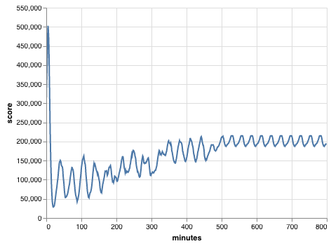

```python
from day18 import *
import pandas as pd
import altair as alt
```


```python
land = Land(day)

df = pd.DataFrame({'minutes': range(800),
                   'score': [land.n_minutes(n=1) for _ in range(800)]})
```


```python
alt.Chart(df).mark_line().encode(
    x='minutes:Q',
    y='score:Q',
    tooltip=['minutes:Q', 'score:Q']
).interactive()
```





It becomes cyclical after a while (starting roughly at 520 minutes). The periodicity is 28 minutes.


```python
df.score[520:].autocorr(28)
```


    1.0


```python
(1000000000 - 520) % 28
```


    4


```python
df.score[523]
```


    202806


And that is the right answer!
